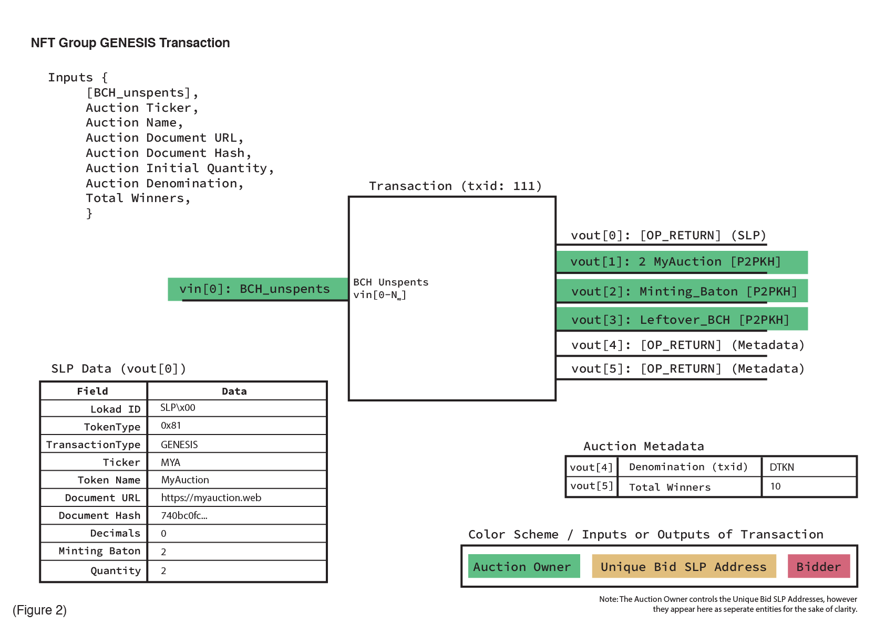

# Proposal Specification for Address-based Bitcoin Cash Auction System

This document intends to provide a detailed specification that will allow anyone with knowledge of it to reconstruct the entirety of an Auction from a provided Auction ID, or to create and run a new Auction of their own. It is assumed that the reader has preexisting knowledge of the Bitcoin Cash network and is familiar with the concepts of Addresses, Transactions, and SimpleLedger Protocol tokens.

## Table of Contents

- Definitions - Page 2
- Auction
- High Level Overview - Page 3
- Creating an Auction - Page 5
- Requesting a Bid Unique SLP Address - Page 7
- Funding a Bid - Page 8
- Completion of an Auction - Page 9
- User Interface Considerations - Page 9
- Example Auction

## Definitions

[More details to be added later]

## High Level Overview

An Auction Owner sets up and begins an Auction. Throughout the duration of the Auction, Bidders send Funding to any number of Bids via that Bid’s Unique SLP Address. A unique Bid is represented by a Simple Ledger Protocol Non-Fungible Token (SLP NFT), which remains locked to a Unique SLP Address through the duration of the Auction. The funds that Bidders send may be made in the denomination determined by the Auction Owner during setup, such as BCH or a specified SLP token. The current value of a Bid is the sum of all Funding sent to that Bid’s Unique SLP Address at that particular point in time. Once an Auction is concluded, the Auction Owner must finalize the Auction results by (1) returning the Funding to the owners of the losing Bids, and (2) sending the Bid NFT to the owners of the respective winning Bids.

A visualization of the layout of an Auction may be seen in Figure 1. In the Green zone of this example, the Auction Owner creates the NFT Group for the Auction (TXID: 111), fans-out 2 fungible Group UTXOs (TXID: 112), mints 1 more Group Fungible (TXID: 113), and fans-out 1 fungible Group UTXO (TXID: 114). In the Blue and Yellow zones, the Auction Owner’s endpoint is responding to requests from Bidders who wish to receive a Bid to fund. After a request is received, a Bid NFT is created and locked to a Unique SLP Address. Transactions (TXID) 121, 122, and 123 in the Blue zone are NFT Child GENESIS type transactions that create the Bid NFT objects. During their creation, these Bid NFTs will be given metadata, such as the SLP Address to return their Funding to (in the case of losing), or where to send their Bid NFT to (in the case of winning). The addresses shown in the Yellow zone are those Unique SLP Address that the previously created Bid NFTs are then locked. There is a one-to-one relationship, in that one Bid NFT should have exactly one Unique SLP Address, and vice versa. Lastly, the Red zone shows (Transactions: 211, 212, 213, 221, 231, and 232) the Bidders sending various quantities of the specified Auction denomination to their respective Bid Unique SLP Address in order to fund their Bids.

## Creating an Auction

An Auction exists as a Non-Fungible Token (NFT) set on the Bitcoin Cash blockchain. Metadata about the Auction is provided in the GENESIS Transaction of the Auction NFT Group, in both the standard SLP fields as well as data in an additional OP_RETURN output. This metadata can be seen in the Inputs of Figure 2.

In the specific example provided in Figure 2, an Auction was created that contains an initial mint quantity of 10, a total of 100 possible winners, and uses the SLP Token denominated by Token ID “zzz”. The initial mint quantity of 10 is locked to vout[1], and must be fanned-out before it can be consumed to create Bid NFTs.

Figure 3 shows an example of this “fan-out” transaction. The previous transaction’s initially minted quantity of 10 is consumed in this transaction's vin[0], fanned-out in vout[1] to vout[n], and the NFT Group change returned in vout[n+1]. The example provided in Figure 1 would have only fanned-out to vout[1] and vout[2], since it only fans-out for 2 Bid NFTs.

TODO: [Diagram for ‘MINTING’ to be added as well]

## Requesting a Unique Bid Address

An endpoint must be provided by the Auction Owner to potential Bidders so that they are able to request Unique Bids to which they will send Funding. This endpoint must have the ability to, when requested by a Bidder, create a NFT Child from the Auction NFT Group, lock the NFT Child to a unique SLP Address, and return the NFT Child ID to the requesting Bidder.

Figure 4 shows a Bid NFT (i.e. NFT Child) consuming a previously fanned-out UTXO of the NFT Group, and then locking (vout[1]) the Bid NFT to a Unique SLP Address. Most of the metadata for the NFT Child doesn’t necessarily need to be filled out, but can be if desired. An additional OP_RETURN provides the Bid NFT with an SLP Address where either (1) the Funding should be returned to if the Bid is lost, or (2) the Bid NFT should be sent to if the Bid is won.

## Funding a Bid

Funding, in the denomination specified by the Auction, is sent to a Bid by a Bidder. A Bidder is able to do this entirely independently once they receive their Bid Unique SLP Address from the Auction Owner’s endpoint. Sending Funding is simply represented by consuming the UTXOs of a specified SLP denomination from the Bidder’s wallet, and locking them to the Bid Unique SLP Address in a standard Pay-To-Public-Key-Hash (P2PKH) transaction.

Figure 5 outlines the straight-forward ‘Funding’ transaction. A Bidder simply sends any quantity of the specifically denominated token for the Auction to the Unique SLP Address they were provided. The value of this Bid is the sum of all the denominated Tokens currently locked to this Bid’s Unique SLP Address.

## Completion of an Auction

Once the Auction Owner has decided it is time for the Auction to end, a block at a specific height will be selected to mark the final Bids. Based on the information provided in the Group NFT metadata, the top N bids, where N is the number of total possible winning Bids, whose summed Funding is the highest will be selected as the winners of the Auction. Next, the Auction Owner will begin the process of returning the Funding to the addresses of those whose Bids who did not win, and sending the respective winning Bid NFTs to the addresses of those whose Bids did win. The Auction Owner may now collect the Funding from the winners’ Bids as the proceeds of the Auction.

[Diagrams to be soon. These are simply SLP Token SEND and NFT SEND Transaction types]

## User Interface Considerations

The User Interface should provide an easy way for the Bidder to view the current top bids, request and track Bid Unique SLP Addresses, and fund their Bids.

[More details to be added later]
