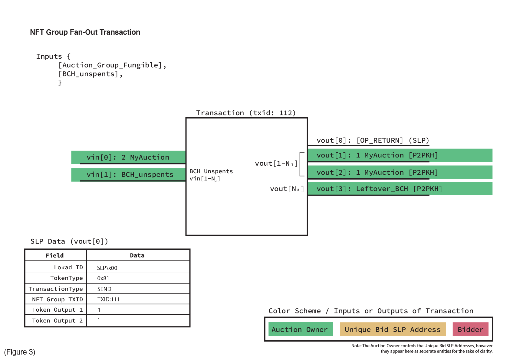
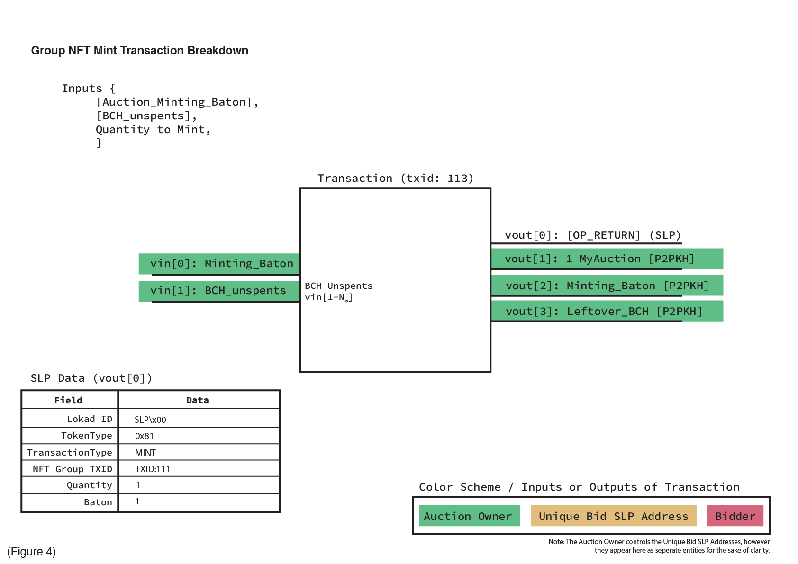
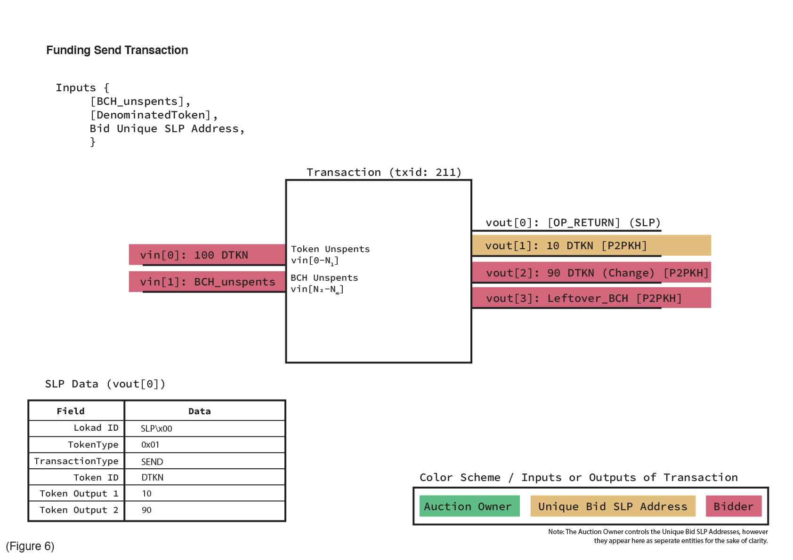
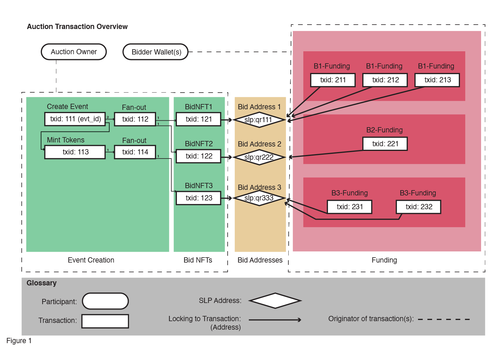

# Proposal Specification for Address-based Bitcoin Cash Auction System

This document intends to provide a detailed specification that will allow anyone with knowledge of it to reconstruct the entirety of an Auction from a provided Auction ID, or to create and run a new Auction of their own.
It is assumed that the reader has preexisting knowledge of the Bitcoin Cash network and is familiar with the concepts of Addresses, Transactions, and with Simple Ledger Protocol tokens.

## Table of Contents

- Our Goal
- High Level Overview
- Creating an Auction
- Requesting a Bid Unique SLP Address
- Funding a Bid
- Completion of an Auction
- User Interface Considerations

<!-- ## Definitions

[More details to be added later] -->

## Our Goal

[...]

## High Level Overview

An Auction Owner creates and begins an Auction. This particular kind of auction is intended for the sale of multiple items that are effectively fungible commodities or distinguishable by only one attribute such as general admission tickets for an event or specific seats for an event. Therefore each object sold will be represented as an SLP Non-fungible Token (NFT). Before the token becomes eligible to represent such an object, it must first start as a Bid NFT and be one of the winning Bid NFTs. A Bidder may have multiple Bid NFTs. The Bidder funds his bid through the commitment of additional Fungible-Tokens or BCH depending on how the Auction is denominated upon creation. The Bidder may increase the amount of any existing Bid NFT but may not reduce an existing bid.

Throughout the duration of the Auction, Bidders send Funding to any number of Bids via a Bid’s Unique Simple Ledger Protocol (SLP) Address.
A unique Bid is represented by a Simple Ledger Protocol Non-Fungible Token (SLP NFT), which remains locked to a Unique SLP Address throughout the duration of the Auction.

The Funding that Bidders send may be made in the denomination determined by the Auction Owner during setup, such as BCH or a specified SLP token.

The current value of a Bid is the sum of all Funding sent to that Bid’s Unique SLP Address at that point in time.
Once an Auction is ready to be concluded, the Auction Owner must finalize the Auction results by (1) sending the Bid NFT to the owners of the respective winning Bids, and (2) returning the Funding to the owners of the losing Bids.

An example showcasing the general relationships between entities of a running Auction is depicted in Figure 1.
In the Green highlighted area of Figure 1, the Auction Owner creates the NFT Group for a new Auction (txid: 111), and initially fans-out 2 fungible Group UTXOs (txid: 112). Later, a Minting transaction (txid: 113) is performed, and an additional fan-out transaction (txid: 114) provides additional UTXOs to later be consumed. A fungible Group UTXO must be created for every bid that will be associated with the Auction.

In the Blue highlighted area of Figure 1, in response to requests from Bidders, new transactions (txid: 121, txid: 122, txid: 123) are created that consume the previously fanned-out Group UXTOs from the fan-out transactions (txid: 112, txid: 114) and result in new Bid NFTs with the appropriate metadata provided by the respective Bidders.
The metadata consists of an SLP Address, which is used to determine where to refund the Bidder's Funding (in the case of losing) or where to send their Bid NFT (in the case of winning).

After a Bid NFT is created it is then locked to a Unique SLP Address, as visualized in the Yellow highlighted area.
There is a one-to-one relationship, in that one Bid NFT should have exactly one Unique SLP Address, and vice versa.
Lastly, the Red zone shows (txid: 211 - 232) the Bidders sending arbitrary quantities of the specified Auction denomination to their respective Bid Unique SLP Addresses (Yellow highlighted area) in order to fund their Bids.
Each of these specific transaction types will be examined in greater detail in the following sections of this document. The diagrams that follow also have references to specific transaction IDs (txid) that were used in the Auction Transaction Overview diagram (Figure 1).

## Creating an Auction

An Auction exists as a Non-Fungible Token (NFT) set on the Bitcoin Cash blockchain.
Metadata about the Auction is provided in the GENESIS Transaction of the Auction NFT Group, in both the standard SLP OP_RETURN output as well as in two additional OP_RETURN outputs.
This metadata can be seen in the Inputs of Figure 2.
All fields are standard SLP *except* for the "Total Winners" and "Denomination" fields, which are specific to the Auction protocol.
*Total Winners* defines how many Auction items in total can be claimed by Auction participants at the conclusion of the Auction.
*Denomination* defines a transaction ID of the specific SLP token that the Auction is accepting. Only 1 denomination may be specified in an Auction, and Bidders will lose access to any tokens they choose to send to a Bid that are __not__ in the specified denomination. The denomination may also be simply set to '0' which indicates that Bitcoin Cash (BCH) should be used as the denomination for that specific Auction.

In the Example Transaction visualized in Figure 2, a new Auction was created that contains an initial mint quantity of 2, a total of 10 possible winners, and uses the SLP Token denominated by Token ID "DTKN".
The initial mint quantity of 2 is locked to vout[1], and must be fanned-out before it can be consumed to create Bid NFTs.

Figure 3 visualizes a “fan-out” transaction.
Some quantity of Group Fungible are consumed in its input (vin[0]), and that quantity is then fanned-out in up to 19 possible outputs (vout[1] to vout[19]).
These outputs will be used to create NFT Children.
If the quantity of the Group Fungible input exceeds 19, then the final output (vout[19]) *__must__* act as SLP return change / leftover for the remaining amount of Group Fungible.

For example, if the input amount of Group Fungible in vin[0] is 30, then vout[1] to vout[18] would contain an output amount of 1 each, and vout[19] would contain the remainder, which is 12 (30 total - 18 used = 12 remaining).
<!-- This is currently the standard way SLP handles preparing Group Fungible to be used in NFT Child creation. # (This last statement isn't entirely accurate. I don't believe there's anything mandating that vout[19] specifically be used as the return change vout.) # -->

In the specific example of our fan-out transaction (txid: 112) in Figure 3, the previous transaction’s (txid: 111) initially minted quantity of 2 "MyAuction" fungible is consumed in this transaction's vin[0], fanned-out in vout[1] and vout[2], outputting exactly 1 "MyAuction" each, and no change is returned because the input contained an amount of exactly 2.

Figure 4 visualizes the Minting of additional Group fungible tokens to be used in fan-out transactions. A Minting Baton must be consumed (coming from the output of either the GENESIS of "MyAuction", or from a previous MINT transaction) in vin[0]. A Mint quantity is specified in the standard SLP OP_RETURN, and that Mint quantity is then locked to the Auction Owner in vout[1]. The Minting Baton is then also passed on via vout[2] to allow for future Minting. In the example transaction, a quantity of 1 was minted and locked to the Auction Owner's address.

## Requesting a Unique Bid Address

An endpoint must be provided by the Auction Owner to potential Bidders so that they are able to request Unique Bids (and the respective Unique Bid SLP Address) to which they will send Funding.
This endpoint must have the ability to, when a request is made by a Bidder, create a NFT Child from the Auction NFT Group, lock the NFT Child to a unique SLP Address, and return the NFT Child Token ID to the requesting Bidder.

Figure 5 shows a transaction in which a Bid NFT (i.e. NFT Child) consumes a previously fanned-out UTXO of the NFT Group ("MyAuction" fungible), and then locks (vout[1]) the Bid NFT to a Unique SLP Address.
The Auction System protocol mandates that all optional fields in the SLP OP_RETURN *__must__* be left blank.
Only the Lokad ID, Token Type, Transaction Type, Decimals, and Quantity fields should contain information.
An additional OP_RETURN provides the Bid NFT with an SLP Address where at the conclusion of the auction, either (1) the Bid NFT will be sent to if the Bid is won, or (2) the Funding will be returned to if the Bid is lost.
In the specific example shown in Figure 5, a previously fanned-out "MyAuction" UTXO is consumed (vin[0]) and 1 new NFT Child is created and locked to a Unique SLP Address (vout[1]).

## Funding a Bid

Funding, in the denomination specified by the Auction, is sent to a Bid by a Bidder.
A Bidder is able to do this independently of the Auction Owner's endpoint once they receive their Bid Unique SLP Address from said endpoint.
Sending Funding is simply represented by consuming the UTXOs of a specified SLP denomination from the Bidder’s wallet, and locking them to the Bid Unique SLP Address in a standard Pay-To-Public-Key-Hash (P2PKH) transaction.

Figure 6 shows a Funding transaction. A Bidder simply sends any quantity of the specifically denominated token (i.e. 'DTKN') for the Auction to the Unique SLP Address they were provided. The value of this Bid is the sum of all the denominated Tokens currently locked to this Bid’s Unique SLP Address. 

In the specific example (txid: 211) of Figure 5, the Bidder sends 10 DTKN to their Unique SLP Address "slp:qr111". Their original DTKN UTXO was 100, and so the remaining 90 DTKN was returned to them as leftover.

## Completion of an Auction

Once the Auction Owner has decided it is time for the Auction to end, a block at a specific height will be selected by which to tally the final Bids.
Based on the information provided in the NFT Group metadata, the top N bids, where N is the number of total winning Bids, whose summation of Funding is the highest will be selected as the winners of the Auction.
Next, the Auction Owner will begin the process of sending the respective winning Bid NFTs to the addresses of those whose Bids won, and returning the Funding to the addresses of those whose Bids who did not win.
The Auction Owner will also collect the Funding from the winners’ Bids as the proceeds of the Auction.

<!-- ## Example

Figure 7 visualizes the state of a small Auction which has 3 Bidders funding 3 Bids.

In this figure, a GENESIS transaction (txid:111) for the Auction NFT Group is created.
An initial quantity of 2 are minted, which are consumed by a fan-out transaction (txid:112).
The Minting Baton of the NFT Group is used in a Minting transaction (txid:113) to mint an additional quantity of 1.
This new quantity is consumed by another fan-out transaction (txid:114).

All 3 existing fan-out outputs are consumed by NFT Child GENESIS transactions (txid:121, txid:122, txid:123) based on requests from Bidders B1, B2, and B3.
These Bidders each provided their preferred return SLP Address which is added as metadata to the NFT Children during their creation.
Each NFT Child is then sent to a Unique SLP Address generated and controlled by the Auction Owner.
Lastly, each of the three Bidders sends some amount of Funding to their respective Unique SLP Address in order to place bids. -->

<!-- [Diagrams to be soon. These are simply SLP Token SEND and NFT SEND Transaction types] -->

<!-- ## User Interface Considerations -->

<!-- The User Interface should provide an easy way for the Bidder to view the current top bids, request and track Bids (and their Bid Unique SLP Addresses), and fund their Bids. -->

<!--  -->

<!-- A convenient way for the user interface to display all bids is to send a query to an instance of SLPDB. -->

<!--  -->

<!-- [More details to be added later] -->

## Limitations

Currently there are several limitations to this model of an Auction System as it relates to the Bitcoin Cash network, nodes, standardness, and Simple Ledger Protocol indexer.

### OP_RETURNs
First and most importantly, the Bitcoin Cash mainnet does not consider multiple OP_RETURNs to be 'standard,' and therefore would pose a challenge to get NFT Group GENESIS and NFT Child GENESIS transactions mined into blocks if they contain the additional OP_RETURNs specified in this protocol.

### Fan-out transaction / OP_RETURN Size Limit (220 bytes)

On the Bitcoin Cash network, OP_RETURNs are limited to 220 bytes in size. This means that in 'SLP SEND' type transactions, such as a fan-out transaction, you are limited to how many outputs to which you can send SLP Tokens. Due to the format / size requirements of the SLP OP_RETURN, a maximum limit of 19 outputs exists. This means that multiple fan-out transactions are required in order for a large scale Auction to take place, which may have hundreds or thousands of Bid NFTs which need to consume fan-out outputs. This issue also possibly compounds with the following issue.

### Bitcoin Cash Node 50 Dependent Limit

The default configuration of Bitcoin Cash Node currently limits the number of dependent transactions to 50.
A dependent transaction is a transaction which consumes the output of another transaction which is still in the mempool.
An example of this may be a fan-out transaction, which produces 18 outputs, and a 19th output for 'return change.'
If the fan-out transaction is still in the mempool, and if NFT Child GENESIS transactions consume each of those 18 outputs, then that fan-out transaction now has a total of 18 dependents.

If the 19th output is consumed by yet another fan-out transaction, there now exist 19 dependents. Finally if the second fan-out transaction provides 18 additional outputs for more NFT Child GENESIS transactions to consume, we are now at 37 dependents.
Blocks are mined roughly every 10 minutes on the Bitcoin Cash network, which means we would be almost certain to reach the limit of 50 dependents in a quickly growing Auction.
We can mitigate the issue to some degree by preparing fan-out outputs in advance.
This mitigation is insufficient, however, in a case where the Auction grows larger or more quickly than we anticipated.

The Bitcoin Unlimited node has a default dependent limit set to 500.
